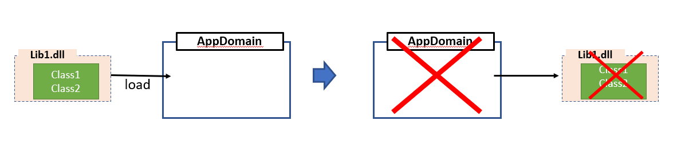
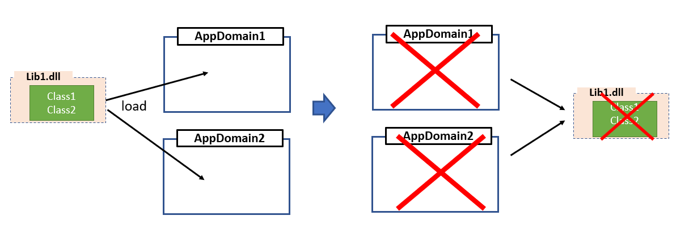
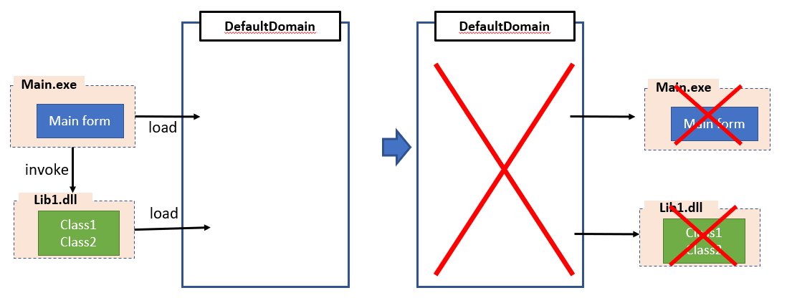

[Main](../README.md)

 - An assembly (ex. DLL, EXE) is automatically loaded into AppDomain container when executed.
 - AppDomain unloaded -> assemble terminated.

- An assemble can loaded into individual appDomains (ex. AppDomain1, AppDomain2)
 - To unload an assemble, all associated appDmains must be unloaded

 - Main form loaded into default appDomain (DefaultDomain) when executed.
 - All assemblies used by main form are loaded into DefautlDomain.
-> To unload assembly, DefaultDomain must be unloaded and  main form terminated.

[Main](../README.md)
