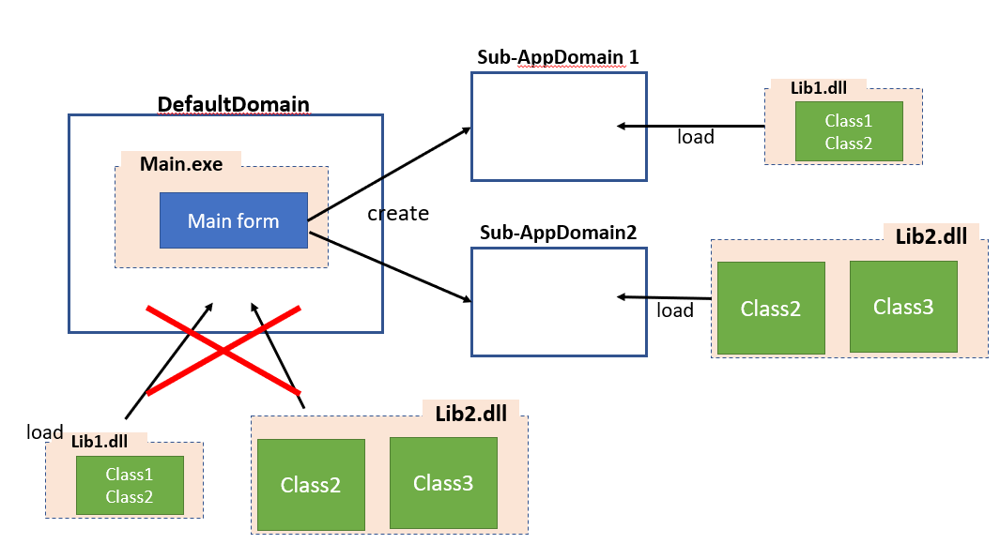
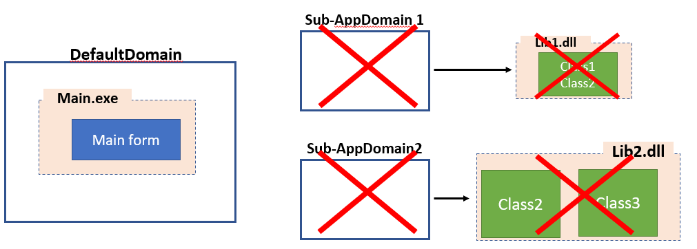
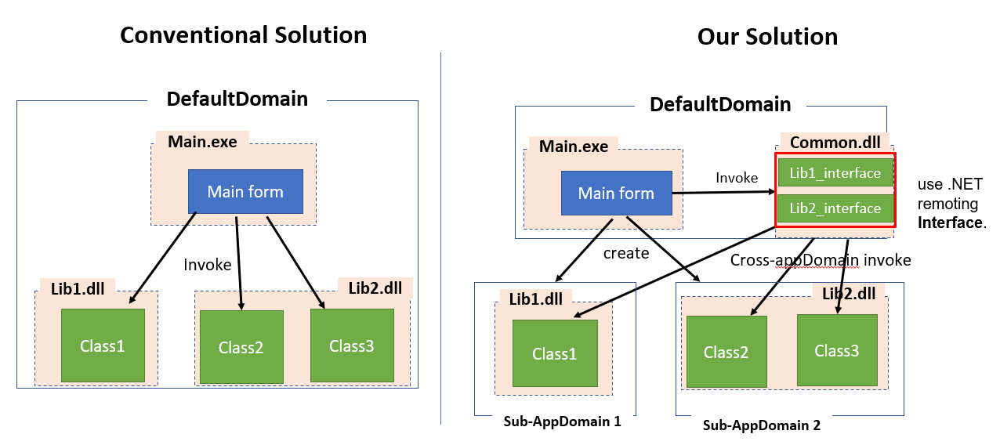
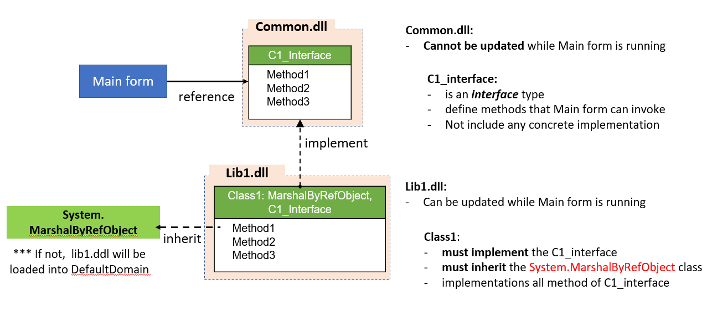

[Main](../README.md)
- Main form automatically create sub-AppDomains, while it loaded.

 - So, when we need to update an assembly, we unload only the corresponding sub-AppDomain and the DefaultDomain is still alive.

[Main](../README.md)
