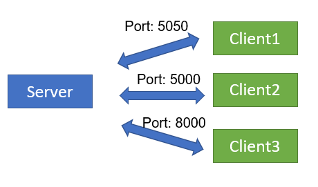

[Main](../README.md)

## Purposes :
  - Server wants to **continuously know information** of users: which users are actives, which are de-actives, number of active users, information of each user.

  - Send commands and update new form for users.
## Issues:
  - Server are always **passive**, mean that, it inactively responds a user’s request. It cannot start a server-client connection.
  
  
  
  - A typical solution: Server **keep connecting** to each user at individual socket port 
-> number of uses loaded at same time, **huge resources** acquired, and server collapsed.   

[Main](../README.md)
